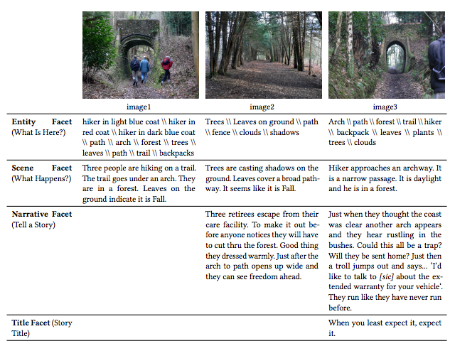
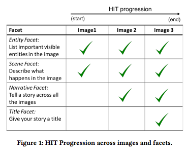
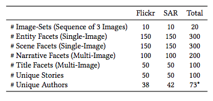
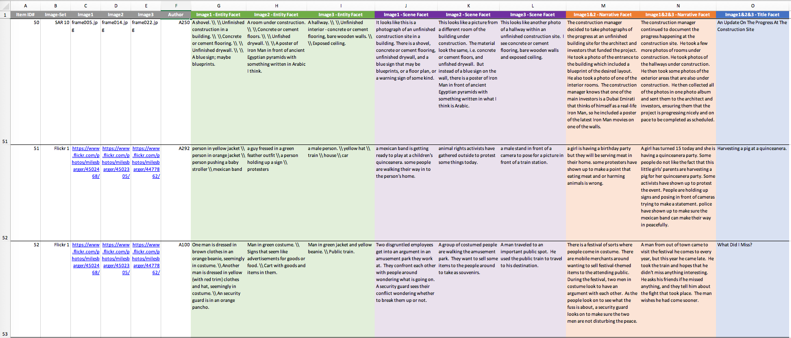

##  ARL Creative Visual Storytelling Anthology

ARL Creative Visual Storytelling Anthology is a collection of 100 author responses to an improved creative visual storytelling exercise. Each item contains four facet entries, corresponding to Entity, Scene, Narrative, and Title. The ARL Creative Visual Storytelling Anthology was collected on Amazon Mechanical Turk.

### ARL Creative Visual Storytelling Anthology Citation

If you would like to publish experiments or analysis with the ARL Creative Visual Storytelling Anthology, please cite the following paper:

- Brett A. Halperin and Stephanie M. Lukin. 2023. [Envisioning Narrative Intelligence: A Creative Visual Storytelling Anthology.](https://doi.org/10.1145/3544548.3580744) In Proceedings of the 2023 CHI Conference on Human Factors in Computing Systems (CHI ’23), April 23–28, 2023, Hamburg, Germany. ACM, New York, NY, USA, 21 pages. https://doi.org/10.1145/3544548.3580744

```
@inproceedings{Halperin2023,
  author = {Halperin, Brett A. and Stephanie M. Lukin},
  title = {Envisioning Narrative Intelligence: A Creative Visual
    Storytelling Anthology},
  year = {2023},
  publisher = {Association for Computing Machinery},
  address = {New York, NY, USA},
  url = {https://doi.org/10.1145/3544548.3580744},
  doi = {10.1145/3544548.3580744},
  booktitle = {Proceedings of the 2023 CHI Conference on Human 
     Factors in Computing Systems},
  location = {Hamburg, Germany},
  series = {CHI '23}
}
```
### Table of Contents
- [ARL Creative Visual Storytelling Anthology Description](#arl-creative-visual-storytelling-anthology-description)
- [Crowdsourcing Interface](#crowdsourcing-interface)
- [Statistics](#statistics)
- [Image Provenance](#image-provenance)
- [Dataset Contents](#dataset-contents)
- [License](#license)

### ARL Creative Visual Storytelling Anthology Description

We formulated an experimental protocol to crowdsource an anthology of human-authored stories from a sequence of three images. We defined four facets of creative visual storytelling from a sequence of images: Entity, Scene, Narrative, and Title. Our facets were designed with both humans and computers in mind, based on the human-process of image understanding and creative storytelling as well as a modular methodology that AI technologies (computer vision, natural language generation, natural language processing, and machine learning) can execute. The selected images represent not only canonical Flickr images, but also non-canonical image sources of a Search-and-Rescue (SAR) scenario. Each item in the anthology contains all text written by each author for the four facets that accompanied a given image sequence. The table below exemplifies one item in the anthology: a complete set of author responses for each facet for a particular image-set.



The first facet was the Entity Facet. Prompting “What is here?” facilitated entity/object recognition compatible with how human and computers process images. The facet mimics the visual activation that draws attention when viewing an image for the first time. Authors were asked to list visible entities, describe visual characteristics, and report their degree of confidence in their assessments. Importantly, this facet was not an exhaustive enumeration task; authors were asked to list only entities that resonated. This facet was single-image and answered for each image.

The second facet was the Scene Facet. Prompting “what happens here?” invited authors to treat the scene as a spatiotemporal snapshot, and provide information about depicted actors and actions. This facet was akin to a literal explanation of the image, and was not intended to read like a story, but rather a factual description, identifying the location, time, and activities. Following a cumulative process, this facet built off authors’ prior knowledge about already identified entities to facilitate piecing together the scene. This was also a single-image facet asked for each image. 

The third facet was the Narrative Facet. This facet to “tell a story” invited authors to narrate across a subset of images following prior responses. Integrating the other facets, this entailed weaving together a span of events and evoking a temporal arrangement of scenes as well as subjective evaluations and orientations. By inviting leaps into possibilities beyond visual observation, this facet also evoked creativity. Unlike the prior facets, this one was multiimage to facilitate storytelling over an image-set sequence. This facet also evoked a sense of natural progression in improvised storybuilding; authors did not have all the visual information available to them when starting the story. As images were revealed one at a time, authors were encouraged to adapt their stories and draw new connections between what they had previously written and what they observed in subsequent images. 

The fourth facet was the Title Facet, asking authors to title their stories. With no requirements, it could be a word, description, or creative expression. This multi-image facet was open-ended, but also implicitly encouraged synthesis. 

These four facets were structured to subdivide the visual storybuilding process into two observable/close-ended facets (Entity and Scene), and two imaginative/open-ended ones (Narrative and Title).

#### Crowdsourcing Interface

The anthology was crowdsourced using a Human Intelligence Task (HIT) on Amazon Mechanical Turk (AMT). The graphic below shows the order of presenting the facets. This figure was also shown to authors in the HIT, so they knew that the storybuilding process would be improvised, but not what image would appear next. The first page in the HIT was a single-image (image1 in Figure 1) and two single-image facets: Entity and Scene. Following this web-page, was another one with a new image (image2) and Entity and Scene single-image facets. Also on this page, image1 and image2 were placed side-by-side with the multi-image Narrative Facet. After this page, a final web-page appeared with a new image (image3) and the Entity and Scene single-image facets again, and additionally all three images side-by-side with the multi-image Narrative Facet (plus what authors had written on the prior page for reference). Instructions were to continue writing the stories that they had started based on the prior two images. Lastly, this page had the Title Facet. The set of text written about one image sequence by one author culminates in one item in the anthology.



#### Statistics

 Five different authors performed the HIT for 20 different Flickr and SAR image-sets for a total of 100 items in the anthology (Table 1 shows one complete HIT). Since some authors completed a HIT for both image-sets, 73 unique authors participated in total. There are 300 unique Entity and Scene entries (single-image facets completed for each image), 200 unique Narrative entries (multi-image facets performed twice with two and then three images), and 100 unique Title entries (multi-image facets completed for three images). Thus, with each one assigned a title, there are 100 unique stories in the anthology all together. Table 2 shows the breakdown by dataset.
 



### Image Provenance

The first set of images used in collecting the anthology originated from Flickr, under Creative Commons Licenses. These images are high-quality resolution, depicting everyday scenery and touring. We chose a subset of Huang et al’s VIST dataset [1] and downselected their image sequences from five to three images to scaffold the Aristotelian dramatic structure. Most photographs did not contain images of people, and most images with people and children clearly in focus were removed to protect privacy. While the images are licensed for use, the people in them could not know that they were being shown to researchers or AMT workers, and we wanted to limit personal exposure. We will not release the Flickr images to track the providence of the images. **The Flickr images' authors and copyright information and usage are documented in the Flickr imageset license spreadsheet.**

The second source of images came from a Search and Rescue (SAR) scenario, that we selected for three reasons. First, the SAR scenario scaffolds the potential for authors to develop a “quest” plot, which is one of the seven basic types of plots. Second, the SAR data exhibits traits in the “environment and presentation of imagery” that we found to be lacking in existing collections of visual storytelling data: in particular, these images were of low-resolution with dim lighting, taken from an atypical camera angle with a camera positioned onboard a small, ground robot. The scenery was devoid of people and depicted the interior of an unfinished building with several rooms and miscellaneous household items. These images greatly contrast to the “everyday” high-resolution circumstances in VIST, and thus contribute to the diversity of data representation.

Our third reason for selecting SAR data was that stories about SAR scenarios may be useful and informative in the real world. The SAR images we utilized were from Marge et al. [2] and Bonial et al.’s [3] human-robot experimentation, in which a human instructed a Wizard-of-Oz robot to navigate through and take pictures of the environment to complete search tasks (i.e., identify and count shoes; assess if space could serve as an impromptu headquarters or meeting location). Their experimental design created a low-bandwidth situation in which natural language communication served to ground the collaboration, bridging the gap between what the robot saw and its ability to convey that information to its human teammate. Automation of the robot’s ability to express visual information through language requires examining the environment and understanding the possible stories that even a vacant and dimly lit space may foster. To uncover possible stories about life-saving circumstances that may be too hazardous for humans to traverse, we used the SAR image-sets in our data collection. We selected three images in-order from different experimental runs, and similar sequential images were excluded for sake of diversity. **The SAR images can be obtained through a private data sharing agreement until the time of their public release in a separate SAR-focused dataset. Please email the second author of the CHI paper for details.**

References
- [1] Ting-Hao Huang, Francis Ferraro, Nasrin Mostafazadeh, Ishan Misra, Aishwarya Agrawal, Jacob Devlin, Ross Girshick, Xiaodong He, Pushmeet Kohli, Dhruv Batra, et al. 2016. *Visual storytelling.* North American Chapter of the Association for Computational Linguistics: Human Language Technologies (NAACL 2016).
- [2] Matthew Marge, Claire Bonial, Brendan Byrne, Taylor Cassidy, A William Evans, Susan G Hill, and Clare Voss. 2016. *Applying the Wizard-Of-Oz Technique to Multimodal Human-Robot Dialogue.* IEEE International Symposium on Robot and Human Interactive Communication (RO-MAN 2016).
- [3] Claire Bonial, Matthew Marge, Ashley Foots, Felix Gervits, Cory J Hayes, Cassidy Henry, Susan G Hill, Anton Leuski, Stephanie M Lukin, Pooja Moolchandani, Kimberly A. Pollard, David Traum, and Clare R. Voss. 2017. *Laying down the yellow brick road: Development of a wizard-of-oz interface for collecting human-robot dialogue.* AAAI Fall Symposium Series.


#### Dataset Contents

[**data/Anthology - 100 Visual Stories.xlsx**](data/Anthology-100-visual-stories.xlsx)
- The entire ARL Creative Visual Storytelling Anthology, an Excel spreadsheet, where one row contains an authors response to the facets per imageset. A screenshot of a subset of entries from the spreadsheet is shown in the figure below, followed by a description of each column


	- **Col A:** The ID for this particular anthology item is given (i.e., one row)
	- **Col B:** The image-set for this item, e.g., Flickr # or SAR #
	- **Col C, D, E:** Images 1, 2, 3. For the Flickr images, a url to the creators album online is provided for quick reference. For the SAR images, only the image name is provided
	- **Col F:** The author of the item. IDs have been anonymized from the data collection.
	- **Col G, H, I:** The Entity Facet entries for image1, image2, and image3 respectively. The symbol `\\` was systematically substituted for a newline break, if the author used any
	- **Col J, K, L:** The Scene Facet entries for image1, image2, and image3 respectively. The symbol `\\` was systematically substituted for a newline break, if the author used any
	- **Col M:** The Narrative Facet for Image1&2. The symbol `\\` was systematically substituted for a newline break, if the author used any
	- **Col N:** The Narrative Facet continuing Image3. Does not overlap with Col M, unless the author repeated content. The symbol `\\` was systematically substituted for a newline break, if the author used any
	- **Col O:** The Title Facet response


[**data/Author Story IDs.xlsx**](data/Author-Story-IDs.xlsx)
- Statistics about the number of stories written by each author, and the item id's

[**data/Flickr Imageset License.xlsx**](data/Flickr-Imageset-License.xlsx)
- The image provinance and current copyright information for the Flickr imagesets


### License

ARL Creative Visual Storytelling Anthology 1.0 is licensed under the Creative Commons Zero 1.0 Universal (CC0 1.0) license. Please see [LICENSE](license) for details.
